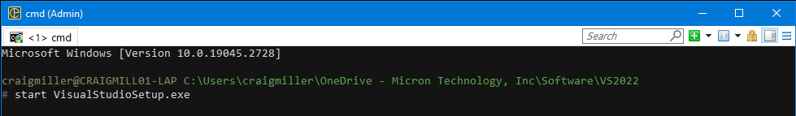
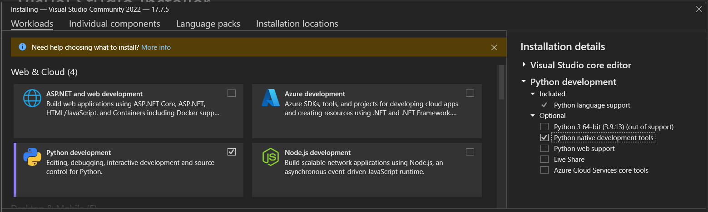
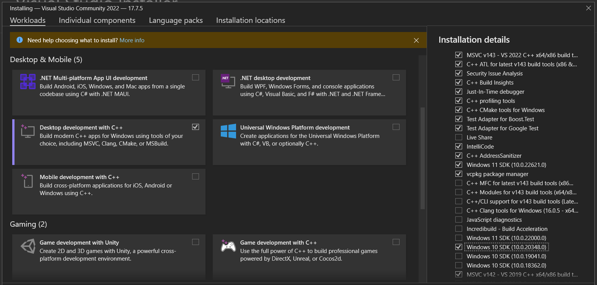
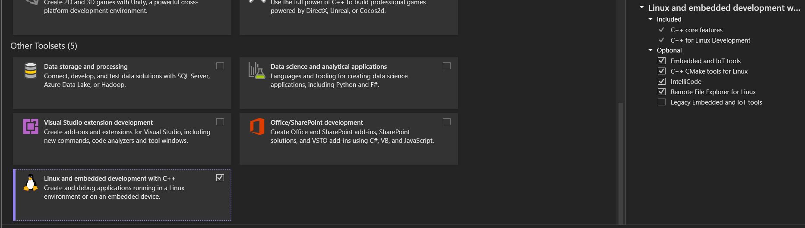

# VS2022

Updated: 2023-10-23

The primary reason for this installation is to get `scrapy` to install with python 3.11 and to more easily work with C++ projects.

---

- [VisualStudioSetup.exe](VisualStudioSetup.exe)

  ```shell
  # Admin terminal
  > start VisualStudioSetup.exe
  ```

  

- Python development options

   

- Desktop development with C++
  - deselect 'Live Share'
  - select 'Windows 10 SDK (10.0.20348.0)
  - select 'MSVC v142 - VS 2019 C++ x64/x86 build tools (v14.29)

   

- Linux

   

---

## References

- [Microsoft C++ Build Tools](https://visualstudio.microsoft.com/visual-cpp-build-tools/)
- [NET prog C++ CLI](https://learn.microsoft.com/en-us/cpp/dotnet/dotnet-programming-with-cpp-cli-visual-cpp?view=msvc-170&viewFallbackFrom=vs-2019)
- [VS2022 download](https://visualstudio.microsoft.com/downloads/)
  - [Thank you for downloading VS2022](https://visualstudio.microsoft.com/thank-you-downloading-visual-studio/?sku=Community&channel=Release&version=VS2022&source=VSLandingPage&cid=2030&passive=false)

---
